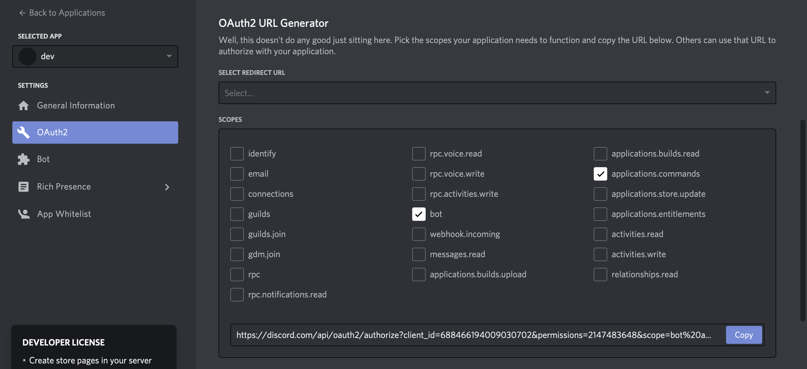
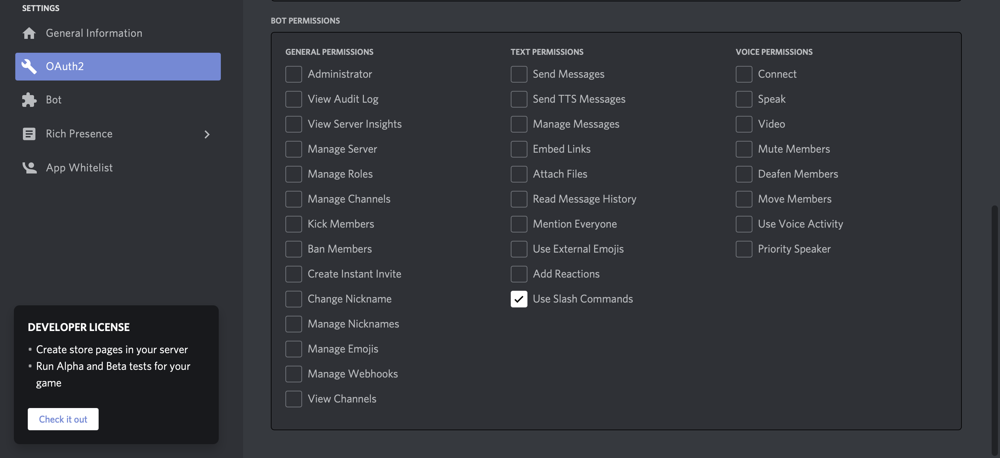

# @Slash - Discord commands

Discord has it's own command system now, you can simply declare commands and use application commands this way

```ts
import { Discord, Slash } from "discordx";

@Discord()
class Example {
  @Slash("hello")
  private hello() {
    // ...
  }
}
```

## Initialize client and application commands

It require a bit of configuration at you Client initialization.
You have to manually execute and initialize your application commands by using:

- `client.initApplicationCommands()`
- `client.executeInteraction(interaction)`

This provide flexibility in your code

```ts
import { Client } from "discordx";

async function start() {
  const client = new Client({
    botId: "test",
    intents: [
      IntentsBitField.Flags.Guilds,
      IntentsBitField.Flags.GuildMessages,
    ],
  });

  client.once("ready", async () => {
    await client.initApplicationCommands();
  });

  client.on("interactionCreate", (interaction) => {
    client.executeInteraction(interaction);
  });

  await client.login("YOUR_TOKEN");
}

start();
```

:::danger
**Global** application commands take time to propagate on discord servers, we recommend to develop on a test server with the **Guild** specific mode

```ts
const client = new Client({
  botId: "test",
  intents: [IntentsBitField.Flags.Guilds, IntentsBitField.Flags.GuildMessages],
  botGuilds: process.DEV ? ["GUILD_ID"] : undefined,
});
```

:::

### Clear application commands from Discord cache

You can remove application commands from the Discord cache by using `client.clearApplicationCommands(...guildIds: Snowflake[])`

> If you do not specify the guild id you operate on global application commands

```ts
client.once("ready", async () => {
  await client.clearApplicationCommands();
  await client.clearApplicationCommands("546281071751331840");
  await client.initApplicationCommands();
});
```

### Fetch application commands from Discord

or fetch them by using `client.fetchApplicationCommands(guildId: string)`

> If you do not specify the guild id you operate on global application commands

```ts
client.once("ready", async () => {
  // ...
  const applicationCommands = await client.fetchApplicationCommands();
});
```

### Get declared application commands

You can retrieve the list of declared application commands on your application (declared using @Slash, @ContextMenu)

```ts
const applicationCommands = client.applicationCommands;
```

### Apply application command to specific guild globally

Instead on doing this for all of your @Slash:

> You can manage it by yourself using your own the Slashes `Client` API and creating your own `client.initApplicationCommands()` implementation

```ts
@Discord()
class Example {
  @Guild("GUILD_ID")
  @Slash("hello")
  private hello() {
    // ...
  }

  @Guild("GUILD_ID")
  @Slash("bye")
  private bye() {
    // ...
  }
}
```

You can do:

```ts
const client = new Client({
  botId: "test",
  intents: [IntentsBitField.Flags.Guilds, IntentsBitField.Flags.GuildMessages],
  botGuilds: ["GUILD_ID"],
});
```

```ts
@Discord()
class Example {
  @Slash("hello") // Applied on GUILD_ID
  private hello() {
    // ...
  }

  @Slash("bye") // Applied on GUILD_ID
  private bye() {
    // ...
  }
}
```

## Signature

```ts
Slash(
  name?: string,
  options?: ApplicationCommandOptions
)
```

## Parameters

### Name

The Slash command name

| type   | default | required |
| ------ | ------- | -------- |
| string |         | YES      |

### options

Multiple options, check below.

| type   | default   | required |
| ------ | --------- | -------- |
| object | undefined | No       |

#### `botIds`

Array of bot ids, for which only the event will be executed.

| type      | default |
| --------- | ------- |
| string[ ] | [ ]     |

#### `Description`

The Slash command description

| type   | default                     |
| ------ | --------------------------- |
| string | Command name - Command type |

#### Guilds

The guilds where the command is created

| type        | default |
| ----------- | ------- |
| Snowflake[] | [ ]     |

## Authorize your bot to use application commands

:::danger
In order to make commands work within a guild, the guild must authorize your application with the `applications.commands` scope. The `bot` scope is not enough. - _**Discord**_
:::

On the Discord's developer portal, select your bot, go to the OAuth2 tab and check the box **bot** AND **applications.commands**




[read more at discord](https://discord.com/developers/docs/interactions/application-commands#authorizing-your-application)

## See also

- [discord.js's documentation](https://discord.js.org)
- [Discord's application command interactions](https://discord.com/developers/docs/interactions/application-commands)
