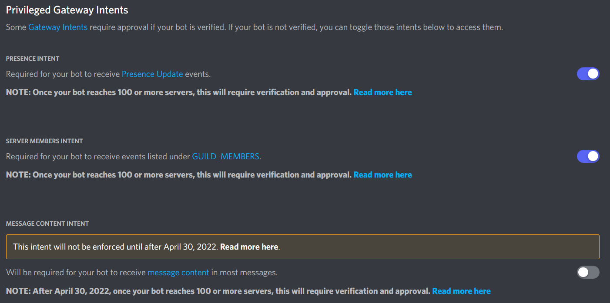

# Common Errors

The most common errors we hear everyday are listed here to help everyone. If you can't find a common error or its solution, please make a pull request or issue.

---

## ERR_MODULE_NOT_FOUND

```markdown
CustomError: Cannot find module '/project/secret' imported from '/project/index.ts'
```

#### Solution

[Read here](/docs/faq/esm-vs-cjs#import-in-cjs-vs-esm)

---

## SyntaxError: The requested module does not provide an export named

```ts
import { ArgsOf, Client } from 'discordx';
^^^^^
SyntaxError: The requested module 'discordx' does not provide an export named 'ArgsOf'

```

#### Solution

Use import type. [Read it in depth](https://devblogs.microsoft.com/typescript/announcing-typescript-3-8-beta/#type-only-imports-exports).

```ts
import { Client, type ArgsOf } from "discordx";
```

---

## Slash: Missing Access

```markdown
      throw new DiscordAPIError(data, res.status, request);
            ^

DiscordAPIError: Missing Access
```

#### Solution

[Authorize your bot to use application commands](/docs/discordx/decorators/command/slash#authorize-your-bot-to-use-application-commands)

---

## DISALLOWED_INTENTS

```
Error [DISALLOWED_INTENTS]: Privileged intent provided is not enabled or whitelisted
```

#### Solution

Some [Gateway Intents](https://discord.com/developers/docs/topics/gateway#gateway-intents) require approval if your bot is verified. If your bot is not verified, you can toggle those intents to access them. - _Discord_


