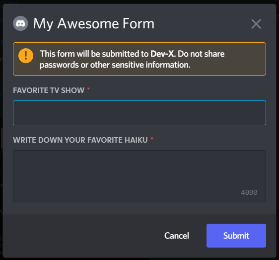

# @ModalComponent

add modal interaction handler for your bot using `@ModalComponent` decorator

Here are some example screenshots:



## Example

```ts
@Discord()
class Example {
  @Slash()
  modal(interaction: CommandInteraction): void {
    // Create the modal
    const modal = new ModalBuilder()
      .setTitle("My Awesome Form")
      .setCustomId("AwesomeForm");

    // Create text input fields
    const tvShowInputComponent = new TextInputBuilder()
      .setCustomId("tvField")
      .setLabel("Favorite TV show")
      .setStyle(TextInputStyle.Short);

    const haikuInputComponent = new TextInputBuilder()
      .setCustomId("haikuField")
      .setLabel("Write down your favorite haiku")
      .setStyle(TextInputStyle.Paragraph);

    const row1 = new ActionRowBuilder<TextInputBuilder>().addComponents(
      tvShowInputComponent
    );

    const row2 = new ActionRowBuilder<TextInputBuilder>().addComponents(
      haikuInputComponent
    );

    // Add action rows to form
    modal.addComponents(row1, row2);

    // --- snip ---

    // Present the modal to the user
    interaction.showModal(modal);
  }

  @ModalComponent()
  async AwesomeForm(interaction: ModalSubmitInteraction): Promise<void> {
    const [favTVShow, favHaiku] = ["tvField", "haikuField"].map((id) =>
      interaction.fields.getTextInputValue(id)
    );

    await interaction.reply(
      `Favorite TV Show: ${favTVShow}, Favorite haiku: ${favHaiku}`
    );

    return;
  }
}
```

## Signature

```ts
@ModalComponent(options: ComponentOptions)
```

## Parameters

### options

The button options

| type             | default   | required |
| ---------------- | --------- | -------- |
| ComponentOptions | undefined | NO       |

## Type: ComponentOptions

### botIds

Array of bot ids, for which only the event will be executed.

| type      | default |
| --------- | ------- |
| string[ ] | [ ]     |

### Guilds

The guilds where the command is created

| type      | default |
| --------- | ------- |
| string[ ] | [ ]     |

### id

A unique id for your button interaction to be handled under.

| type             | default       | required |
| ---------------- | ------------- | -------- |
| string \| RegExp | function name | No       |
