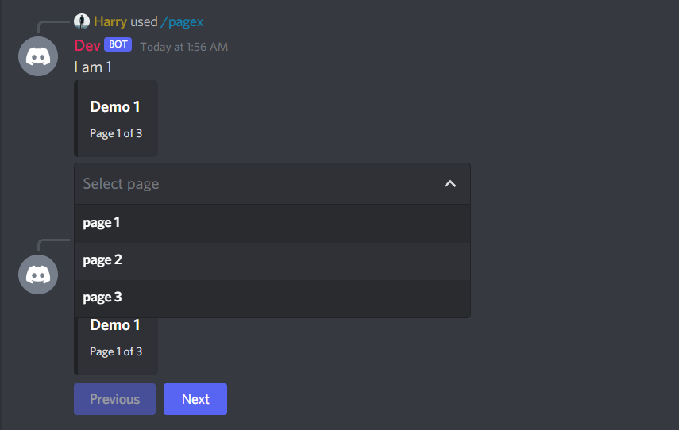

# @discordx/utilities - Embed Pagination

- Use embed pagination with discord new buttons and select menu
- fully customizable (if you think something missing, just open a issue, so that we can add)



# Example

```ts
import { CommandInteraction, MessageEmbed } from "discord.js";
import { Discord, Slash } from "discordx";
import { sendPaginatedEmbeds } from "@discordx/utilities";

const pages = [
  { content: "I am 1", embed: "Demo 1" },
  { content: "I am 2", embed: "Demo 2" },
  { content: "I am 3", embed: "Demo 3" },
];

const embeds = pages.map((page) => {
  return {
    content: page.content,
    embed: new MessageEmbed().setTitle(page.embed),
  };
});

@Discord()
export abstract class StonePaperScissor {
  @Slash("page")
  private async page(interaction: CommandInteraction) {
    await sendPaginatedEmbeds(interaction, embeds, {
      type: "BUTTON",
    });
  }

  @Slash("pagex")
  private async pagex(interaction: CommandInteraction) {
    await sendPaginatedEmbeds(interaction, embeds, {
      type: "SELECT_MENU",
    });
  }
}
```

# Installation

> NPM

```
npm install @discordx/utilities
```

> yarn

```
yarn add @discordx/utilities
```

# Thank you
